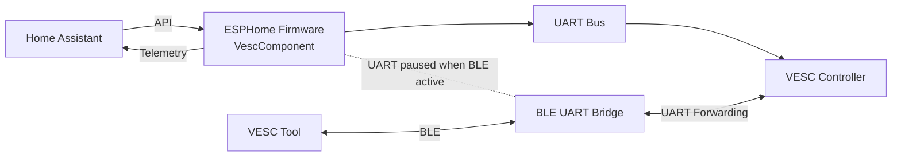

## ESPHome VESC Component

This component allows an ESP32 running ESPHome to communicate with a VESC motor controller over UART.
Telemetry from the VESC is exposed to Home Assistant and several control modes are available.

The component can also coexist with **VESC Tool over BLE**, allowing configuration or debugging without disconnecting the ESPHome device.

---
## ⚠ Safety Notice

Brushless DC motors controlled by a VESC can produce significant torque and high rotational speeds. Improper configuration or control can result in equipment damage or personal injury.

Before using this component:

* Use the excellent **[VESC Tool](https://vesc-project.com/vesc_tool)** to configure the firmware in your controller, set appropriate current and rpm limits.
* **Verify all control limits** (`min_value`, `max_value`, `step`) in your ESPHome configuration.
* Ensure limits are appropriate for **your motor, controller, power supply, and mechanical system**.
* Start with **very conservative limits** and increase them gradually during testing.
* Make sure the motor and any connected mechanism are **securely mounted** and cannot cause harm if they start unexpectedly.
* Always test new configurations with **physical access to power disconnects or emergency stop controls**.

The author of this project cannot guarantee safe operation in all environments.
Use at your own risk and ensure your system is designed with appropriate safety margins.

---

# Hardware

Typical UART wiring:

| ESP32 | VESC |
| ----- | ---- |
| TX    | RX   |
| RX    | TX   |
| GND   | GND  |

Default UART speed used by VESC:

```
115200 baud
```

---

# Installation

Add the component using `external_components`.

```yaml
external_components:
  - source:
      type: local
      path: components
    components: [vesc_component, ble_uart_component]
```

Or use a GitHub source if the repo is added as an external component repository.

---

# Basic Configuration

```yaml
uart:
  id: esp_uart
  tx_pin: GPIO17
  rx_pin: GPIO16
  baud_rate: 115200

vesc_component:
  id: my_vesc_hub
  uart: esp_uart
  update_interval: 2s
  motor_pole_pairs: 21

  # Optional telemetry boost after control input
  boost_interval: 150
  boost_duration: 3000
```

### Parameters

| Option             | Description                                                |
| ------------------ | ---------------------------------------------------------- |
| `uart`             | UART bus connected to the VESC                             |
| `update_interval`  | Base telemetry polling interval                            |
| `motor_pole_pairs` | Motor pole pairs used for ERPM → mechanical RPM conversion |
| `boost_interval`   | Faster polling interval after a control change             |
| `boost_duration`   | Duration of the faster polling period                      |

---

# Available Sensors

Sensors correspond to fields returned by the VESC `COMM_GET_VALUES` message.

Example:

```yaml
sensor:
  - platform: vesc_component
    vesc_id: my_vesc_hub

    voltage:
      name: "Input Voltage"

    rpm:
      name: "RPM"

    duty:
      name: "Duty Cycle"

    input_current:
      name: "Input Current"

    phase_current:
      name: "Phase Current"

    fet_temp:
      name: "FET Temperature"

    wattage:
      name: "Wattage"

    fault_code:
      name: "Fault Code"
```

### Sensor Descriptions

| Sensor        | Description                     |
| ------------- | ------------------------------- |
| Voltage       | DC input voltage                |
| RPM           | Mechanical motor RPM            |
| Duty          | PWM duty cycle                  |
| Input Current | Current drawn from supply       |
| Phase Current | Motor phase current             |
| FET Temp      | Temperature of the MOSFET stage |
| Wattage       | Calculated power consumption    |
| Fault Code    | Raw numeric VESC fault code     |

---

# Text Sensors

Additional textual telemetry can also be exposed.

```yaml
text_sensor:
  - platform: vesc_component
    vesc_id: my_vesc_hub

    control_mode:
      name: "Control Mode"

    fault_text:
      name: "VESC Fault"

    lisp_print:
      name: "VESC Lisp Output"
```

### Text Sensor Descriptions

| Sensor       | Description                               |
| ------------ | ----------------------------------------- |
| Control Mode | Current control mode (`R`, `D`, `C`, `N`) |
| Fault Text   | Human-readable fault description          |
| Lisp Output  | Messages printed from VESC Lisp scripts   |

---

# Motor Control

Three control modes are available. Only one mode is active at a time.

Limits are configured using the **standard ESPHome Number component parameters** (`min_value`, `max_value`, `step`).

Example:

```yaml
number:
  - platform: vesc_component
    vesc_id: my_vesc_hub

    rpm_control:
      name: "Motor Target RPM"
      min_value: -100
      max_value: 410
      step: 1

    current_control:
      name: "Motor Target Current"
      min_value: 0
      max_value: 2.8
      step: 0.028

    duty_control:
      name: "Motor Target Duty Cycle"
      min_value: 0
      max_value: 0.5
      step: 0.005
```

### Control Modes

| Mode    | Description           |
| ------- | --------------------- |
| RPM     | Target mechanical RPM |
| Current | Target motor current  |
| Duty    | Raw duty cycle        |

If no control input is active, the controller sends **0 A current**, allowing the motor to coast.

---

# BLE Bridge

This project optionally includes a **BLE UART bridge** allowing VESC Tool to connect through the ESP32.

Example control switch:

```yaml
switch:
  - platform: template
    name: "BLE UART Bridge"

    lambda: |-
      return id(my_ble_uart_component).is_enabled();

    turn_on_action:
      lambda: id(my_ble_uart_component).set_enabled(true);

    turn_off_action:
      lambda: id(my_ble_uart_component).set_enabled(false);
```

When VESC Tool connects via BLE:

* the ESPHome component temporarily **stops accessing the UART**
* the BLE bridge forwards packets directly to the VESC

This prevents packet corruption caused by two devices using the same serial interface.

---

# Example System Architecture



---

# Configuration Reference

## `vesc_component`

| Option             | Type      | Default      | Description                                                         |
| ------------------ | --------- | ------------ | ------------------------------------------------------------------- |
| `uart`             | ID        | **required** | UART bus connected to the VESC controller                           |
| `update_interval`  | Time      | `1s`         | Base interval for requesting telemetry from the VESC                |
| `motor_pole_pairs` | Integer   | `15`         | Number of motor pole pairs used to convert ERPM to mechanical RPM   |
| `boost_interval`   | Time (ms) | `150ms`      | Faster telemetry polling interval immediately after a control input |
| `boost_duration`   | Time (ms) | `3000ms`     | Duration of the boosted polling period                              |

### Notes

`motor_pole_pairs` affects how RPM is reported:

```
mechanical_rpm = erpm / motor_pole_pairs
```

Make sure this value matches the motor connected to your VESC.

---
## Sensor Platform

```yaml
sensor:
  - platform: vesc_component
```

| Option          | Description                      |
| --------------- | -------------------------------- |
| `voltage`       | VESC input voltage               |
| `rpm`           | Mechanical motor RPM             |
| `duty`          | PWM duty cycle                   |
| `input_current` | Current drawn from the DC source |
| `phase_current` | Motor phase current              |
| `fet_temp`      | MOSFET temperature               |
| `wattage`       | Calculated power consumption     |
| `fault_code`    | Raw VESC fault code              |

---

## Number Platform (Motor Control)

```yaml
number:
  - platform: vesc_component
```

| Entity            | Description           |
| ----------------- | --------------------- |
| `rpm_control`     | Target mechanical RPM |
| `current_control` | Target motor current  |
| `duty_control`    | Target duty cycle     |

Limits are configured using standard ESPHome parameters:

```
min_value
max_value
step
```

Example:

```yaml
rpm_control:
  name: "Fan RPM"
  min_value: -100
  max_value: 410
  step: 1
```

---

## Text Sensor Platform

```yaml
text_sensor:
  - platform: vesc_component
```

| Entity         | Description                                 |
| -------------- | ------------------------------------------- |
| `control_mode` | Active control mode (`R`, `C`, `D`, or `N`) |
| `fault_text`   | Human-readable VESC fault description       |
| `lisp_print`   | Output printed from VESC Lisp scripts       |

---

# Example: Ceiling Fan Controller

This project was originally built to monitor and control a **VESC-driven ceiling fan** from Home Assistant.

The ESP32 communicates with the VESC over UART and exposes telemetry such as RPM, power consumption, and temperature. Fan speed can be controlled directly from the Home Assistant UI.

Example configuration:

```yaml
external_components:
  - source:
      type: local
      path: components
    components: [vesc_component, ble_uart_component]

uart:
  id: esp_uart
  tx_pin: GPIO17
  rx_pin: GPIO16
  baud_rate: 115200

vesc_component:
  id: my_vesc_hub
  uart: esp_uart
  update_interval: 2s
  motor_pole_pairs: 21
  boost_interval: 150
  boost_duration: 3000

sensor:
  - platform: vesc_component
    vesc_id: my_vesc_hub

    voltage:
      name: "Fan Supply Voltage"

    rpm:
      name: "Fan RPM"

    wattage:
      name: "Fan Power"

    fet_temp:
      name: "VESC Temperature"

number:
  - platform: vesc_component
    vesc_id: my_vesc_hub

    rpm_control:
      name: "Fan Speed"
      min_value: 0
      max_value: 410
      step: 1
```

This exposes:

* live **fan RPM**
* **power consumption**
* **VESC temperature**
* a **speed control slider** in Home Assistant

Adding a dashboard card allows the fan to be controlled and monitored from a single interface.

---
## License

This project is licensed under the GNU General Public License v3.0 (GPL-3.0).

Portions of this code are derived from:

- VESC BLDC Firmware — https://github.com/vedderb/bldc
  Copyright (c) Benjamin Vedder

- VescUart Library — https://github.com/SolidGeek/VescUart
  Copyright (c) SolidGeek

Modifications include refactoring for ESPHome and conversion to a non-blocking
implementation compatible with ESPHome’s execution model.

See the LICENSE file for full details.

---
# Acknowledgements

Parts of the VESC communication protocol originate from:

* VESC firmware by **Benjamin Vedder**
* The **VescUart** Arduino library by **SolidGeek**

Some adaptations were made to integrate the protocol with ESPHome’s runtime model.
